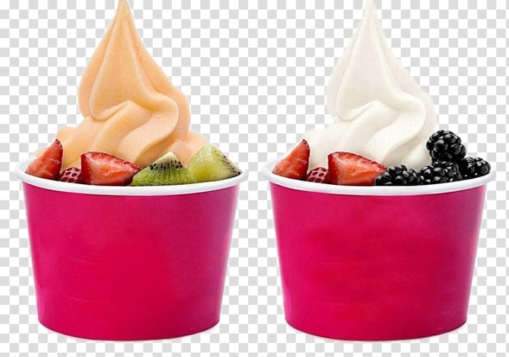
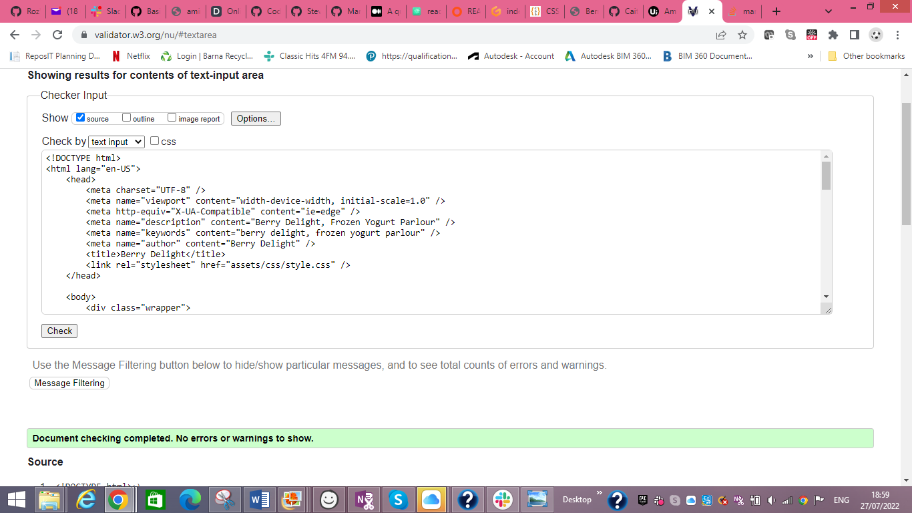
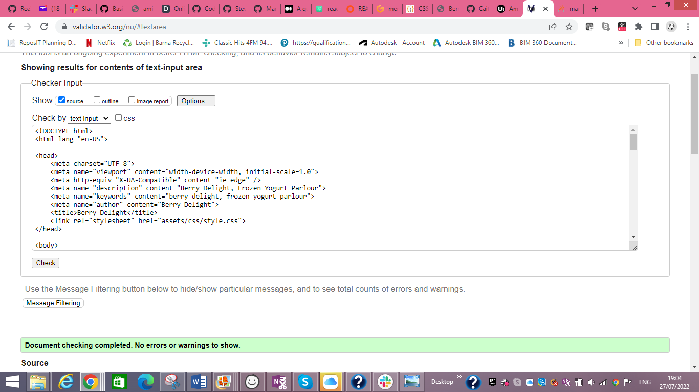
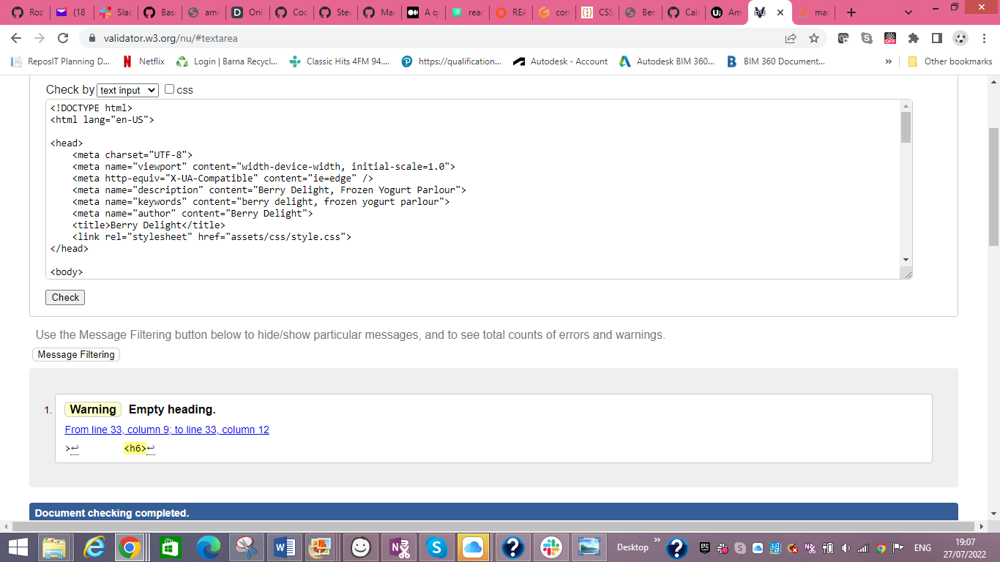
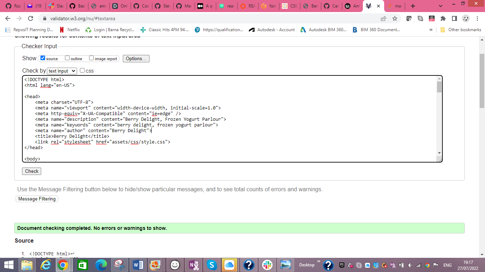

# **PROJECT 1 Berry Delight Frozen Yogurt Parlour**
Berry Delight is a site showcasing the business of a Frozen Yogurt Parlour. It's aim is to attract users who are searching for frozen yogurt desserts. The site will be used by users to access the menu, contact details, and competition page. 
 

This is the live site:  [Berry Delight](https://caitriona71.github.io/berry-delight2/)

## **Features**
The home page details information about the business and a list of suppliers. The menu page includes the various selection of frozen yogurt desserts, smoothies and drinks available, the contact us page displays a location map, contact details and business opening hours, and the competition page includes a form to fill out for a chance to win a Lego Frozen Yogurt Shop set, together with images of the prize.

## **Existing Features**

### ***Navigation Bar***
The fully responsive navigation bar is on all four pages of the site. It includes links to the home page, menu page, contact us page and a link to a competition page with a form to fill out to enter the competition. The navigation bar is identical on all four pages. The navigation bar allows for easy navigation from one page to the other across all devices. 

### ***Home Page***

The home page displays a header with a background image of the frozen yogurt parlour, the name of the business and when it was established.  Underneath the header there is information about the business story and their mission, a list of their local suppliers and an image of some of the frozen yogurts available.

### ***Footer Section***

The footer section includes links to their social media sites - Facebook, Twitter and Instagram.  These links when clicked open in a new tab.  The social media links displayed in the footer are useful to the user as this will encourage them to connect via social media.  Copyright is also displayed here.  The footer section is displayed identically on each page of the site.

### ***Menu Page***

The menu page displays the header identical to the home page.  The parlour menu is featured underneath the header, and again - the footer.

### ***Contact Us Page***

On this page a location map has been included.  This is not the actual map location as the business is fictional. The contact details displaying phone number, email address and business address are also included on this page, together with the business opening hours.  The footer is again displayed at the bottom of the Contact Us page.

### ***Win Page***

The last link on the navigation bar is a link to a page which enables the user to fill out a form in order to enter a competition to be in with a chance of winning a Lego Heartland Frozen Yogurt Shop set.  On this page, the user is asked to fill out their name and email address on the form and they are then asked which of the Berry Delight Frozen Yogurts is their favourite.  The form allows them to tick whichever checkbox pertains to their favourite.

## **Technologies Used**

* HTML5
* CSS

## **Frameworks, Libraries and Programmes Used**

* [Google Fonts](https://fonts.google.com)
* [Font Awesome](https://fontawesome.com)
* [Gitpod](https://gitpod.io)
* [GitHub](https://github.com)
* [Balsamiq](https://balsamiq.com)
* [CSS Portal RGBA Generator](https://www.cssportal.com/css3-rgba-generator/)

## **Future Improvements**

* Menu page would need prices included and this page would need to be regularly updated. 

* A hamburger menu would be useful for mobiles.  

* More images for menu page required.

## **Validator Testing**

***Lighthouse*** - the site was tested for performance using Lighthouse. 
 
 
***3C Validator*** - CSS was validated with W3C. 

 

***W3C Validator*** - HTML was validated with W3C. 
 
 
 
 
 
 
 

## **Deployment**

The site was deployed to GitHub pages.  The steps to deploy are as follows:

* In the GitHub repository, click on the Settings tab.
* From the Source Section drop-down menu, select the Main branch.
* Once the Main branch has been selected, the page will be refreshed with a detailed ribbon display indicating that the project was successfully deployed.

## **Credits**

### ***Content***

All names of business and suppliers, and all text content is fictional with the exception of items on the menu page from Pinterest.

Images from png.is, pexels, Pinterest and Lego.

Navigation bar - instructions for implementation from Love Running Project, Code Institute

Flexbox Layout from YouTube

## **Acknowledgements**

My mentor for his feedback.  
Tutor Support at Code Institute.  
My fellow students.  

